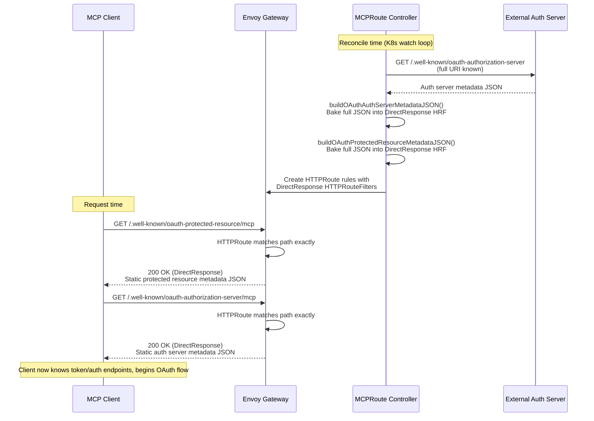
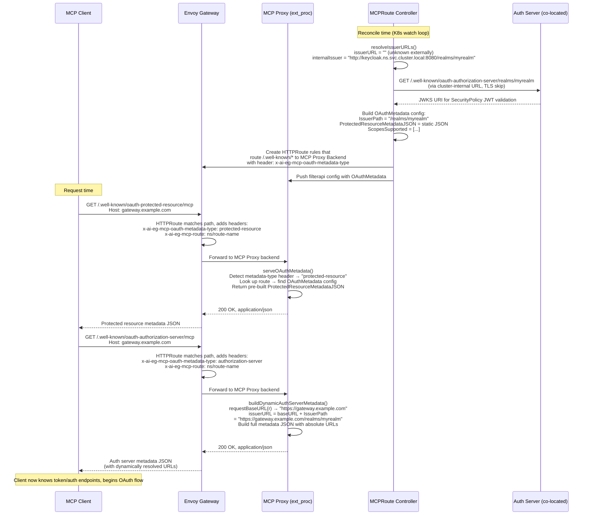

# OAuth Metadata Discovery Flow
This document explains how OAuth metadata discovery requests travel through the AI Gateway for both issuer configurations: **URI** (full external URL) and **Path** (relative, co-located behind the same Gateway).
---
## Flow 1: URI Issuer (`issuer.uri`)
The issuer is a full external URL (e.g., `https://auth.example.com/realms/myrealm`).
Everything is resolved **statically at controller reconcile time**. The metadata JSON is baked into Envoy DirectResponse HTTPRouteFilters.

### Key point
Envoy serves the response directly via its DirectResponse filter. The MCP proxy is **never involved** for metadata endpoints. The full `issuer` URL is known at controller time, so all URLs in the JSON are absolute.
---
## Flow 2: Path Issuer (`issuer.path`)
The issuer is a relative path (e.g., `/realms/myrealm`) — the auth server is co-located behind the same Gateway.
The gateway's external URL/DNS is **unknown at controller reconcile time**. Metadata is served **dynamically at request time** by the MCP proxy, which reads the incoming request's `Host` header.

### Key point
The controller has no knowledge of the gateway's public DNS/IP. At request time, the MCP proxy reads `Host: gateway.example.com` and `X-Forwarded-Proto: https` from the incoming request to construct `https://gateway.example.com/realms/myrealm` as the issuer URL. All other endpoint URLs derive from that.
---
## Component Responsibilities Summary

```mermaid
flowchart TB
    subgraph "Controller Time - Reconcile"
        A[MCPRoute CR] --> B{issuer.uri or issuer.path?}
        B -->|uri| C[resolveIssuerURLs → full URL known]
        C --> D[Fetch auth server metadata externally]
        D --> E[Bake into DirectResponse HTTPRouteFilters]
        E --> F[HTTPRoute rules: path → DirectResponse]
        B -->|path| G[resolveIssuerURLs → issuerURL empty]
        G --> H[Fetch JWKS via cluster-internal URL<br/>for SecurityPolicy JWT validation]
        H --> I[Build filterapi.MCPOAuthMetadata<br/>IssuerPath + static JSON pieces]
        I --> J[HTTPRoute rules: path → MCP Proxy Backend<br/>+ x-ai-eg-mcp-oauth-metadata-type header]
    end
    subgraph "Request Time"
        K[MCP Client] --> L{Request path?}
        L -->|/.well-known/* + URI issuer| M[Envoy DirectResponse<br/>Static JSON, no proxy involved]
        L -->|/.well-known/* + Path issuer| N[Envoy routes to MCP Proxy]
        N --> O[Proxy reads Host header<br/>baseURL = scheme://host]
        O --> P[Constructs full URLs:<br/>baseURL + IssuerPath]
        P --> Q[Returns dynamic JSON response]
        L -->|/mcp| R[Normal MCP request flow<br/>Proxy → Backend MCP servers]
    end
```

---
## Files Involved
| File | Role |
|------|------|
| `api/v1alpha1/mcp_route.go` | Defines `MCPRouteOAuthIssuer` with `uri` / `path` fields |
| `internal/controller/mcp_route.go` | Builds HTTPRoute rules — DirectResponse (URI) vs proxy routing (Path) |
| `internal/controller/mcp_route_security_policy.go` | Builds metadata JSON, resolves issuer URLs, creates HRFs and SecurityPolicies |
| `internal/controller/gateway.go` | Populates `filterapi.MCPOAuthMetadata` in the proxy config for path-based issuers |
| `internal/filterapi/mcpconfig.go` | Defines `MCPOAuthMetadata` struct passed to the MCP proxy |
| `internal/mcpproxy/oauth_metadata.go` | Handles dynamic metadata serving — reads Host, builds full URLs |
| `internal/mcpproxy/mcpproxy.go` | Main proxy handler — intercepts metadata requests via header check |
| `internal/mcpproxy/config.go` | Loads `OAuthMetadata` from filterapi config into proxy route state |
| `internal/internalapi/internalapi.go` | Defines `MCPOAuthMetadataTypeHeader` constant |
